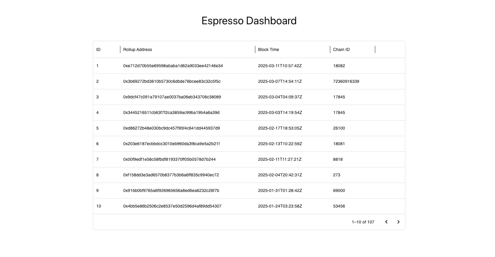

# Espresso Dashboard



This dashboard shows details about the rollups deployed on the Arbitrum mainnet and details about each of the rollups, like contracts related to rollups, net bridged assets, and bridge in and out transfers.

Check out the live dashboard here: [https://espresso-dashboard.vercel.app/](https://espresso-dashboard.vercel.app/)

## Installation

To run it locally, first you need to clone the repo with:

```bash
git clone https://github.com/ashishbhintade/espresso-dashboard
```

After that, create a `.env.local` file and add the Bitquery Auth Token in it:

```bash
BEARER_TOKEN=<your_bearer_token>
```

> You can get your bearer token like this - https://docs.bitquery.io/docs/authorisation/how-to-generate/

And to run it:

```bash
yarn dev
```

## Tech Stack

This project has used the following:

- Next.js for frontend
- Apollo Client for data fetching
- Shadcn and Mui for styling
